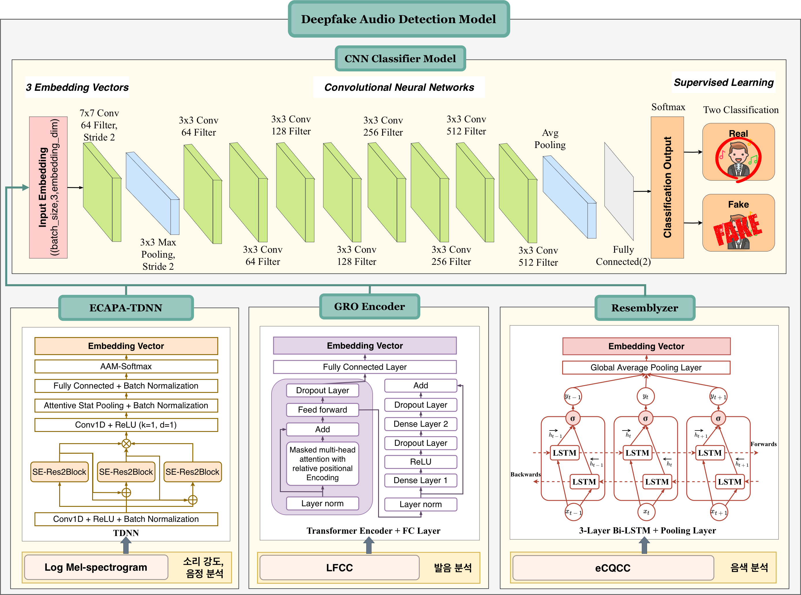

# Deepfake Audio Detection 🎙️🔒

[](https://www.python.org/)
[](https://pytorch.org/)
[](https://opensource.org/licenses/MIT)

An advanced deep learning framework designed to detect AI-generated synthetic speech, voice conversion clones, and deepfake audio (including synthetic singing voices). This repository focuses on robust feature extraction and customized deep learning architectures to ensure audio security and authenticity.

---

## 📌 Project Overview
With the rapid advancement of generative speech synthesis and voice conversion (VC) technologies, distinguishing manipulated audio from genuine human speech has become a critical challenge. This project implements a comprehensive pipeline—from acoustic feature extraction to optimized neural network classifiers—to robustly identify voice clones and audio deepfakes.

### Key Features
- **Diverse Feature Extraction:** Implements state-of-the-art acoustic features tailored for synthetic speech artifact detection (e.g., LFCC, eCQCC, Mel-Spectrogram).
- **Optimized Deep Learning Architectures:** Optimized CNN-based structures and specialized neural networks to capture subtle mathematical anomalies in synthetic audio.
- **Robust Generalization:** Designed to counter high-fidelity generation frameworks and robustly detect voice conversion vulnerabilities.

---

## 🛠️ System Architecture

### 1. Data Processing & Feature Extraction Pipeline
The pipeline transforms raw audio waveforms into highly discriminative time-frequency representations optimized to reveal synthesis artifacts.

<p align="center">
  <!-- 데이터 처리 흐름도 이미지가 있다면 여기에 배치 (크기 70%) -->
  
</p>

### 2. Model Architecture
The core classifier utilizes a customized deep learning structure to distinguish the fine-grained nuances between real human voices and deepfake audio.

<p align="center">
  <!-- 모델 구조 이미지 크기 조절 및 중앙 정렬 -->
  
</p>

---

## 📊 Experimental Results (Example)
The model's performance evaluated using standard audio deepfake detection metrics (e.g., Equal Error Rate - EER):

| Feature Set | Classifier Architecture | Accuracy (%) | EER (%) |
| :--- | :--- | :---: | :---: |
| Mel-Spectrogram | Baseline CNN | 92.4% | 5.2% |
| **LFCC / eCQCC** | **Our Optimized Model** | **98.1%** | **1.8%** |

---

## 🚀 Getting Started

### Prerequisites
Ensure you have the following dependencies installed:
```bash
pip install torch torchvision torchaudio numpy pandas librosa matplotlib
